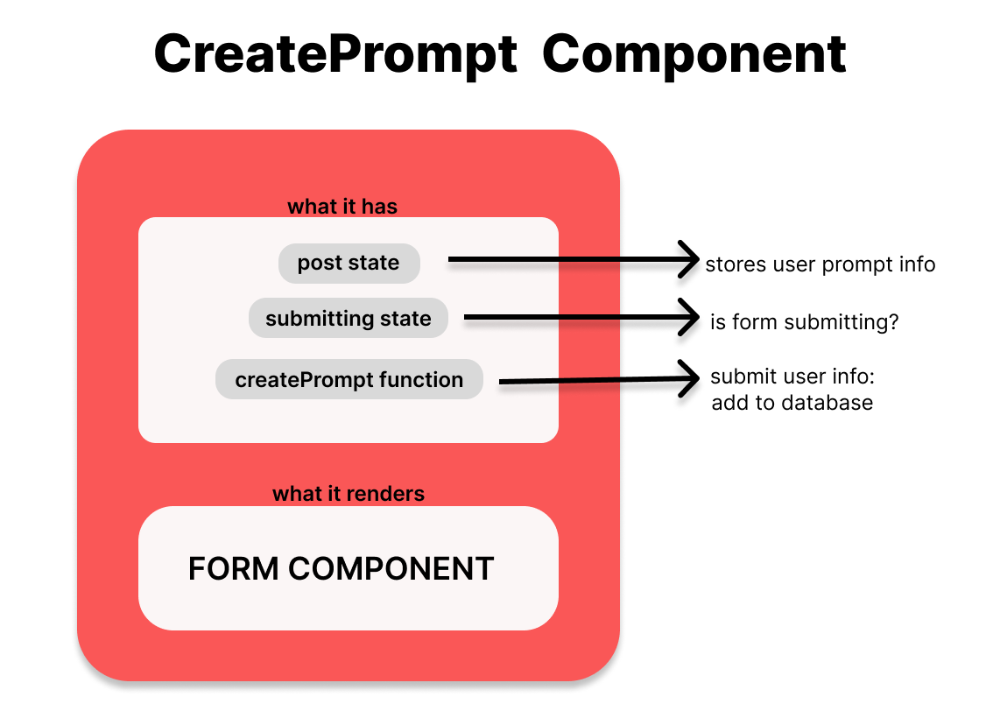
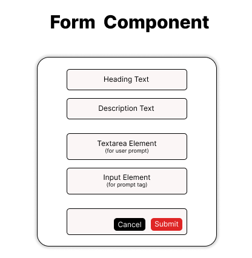
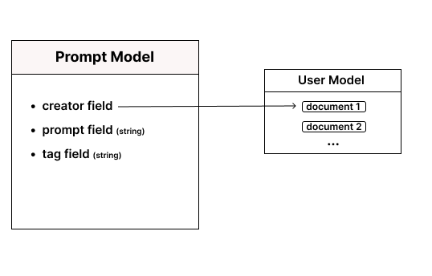
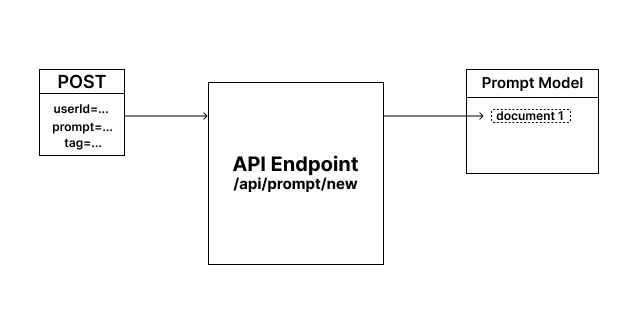

## The CreatePrompt Component

The `CreatePrompt` component is associated with the frontend route `/create-prompt`. 
- It serves as the main frontend element responsible for allowing users to create new prompts. 
- It renders a `Form` component that collects prompt data from the user, 
- It manages the submission process, 
- and It interacts with the database API.



<br><br>

### What It Does

- Renders a `Form` component that collects prompt data and passes it via the `post` state.
- Defines the `createPrompt` function, which sends user prompt information to the backend API endpoint `/api/prompt/new` via a POST request. This endpoint adds the prompt information as a record in the PROMPT table in the database. The `createPrompt` function is invoked when the form in the `Form` component is submitted.

<br><br>

### What It Returns

The `CreatePrompt` component returns the following JSX:

```jsx
<Form
    type="Create"
    post={post}
    setPost={setPost}
    handleSubmit={createPrompt}
    submitting={submitting}
/>
```
- the `post` and `setPost` props correspond to a state that stores the user's prompt text and prompt tag.
- the `handleSubmit` prop holds the function that is called when the form element in the `Form` component is submitted. It refers to the `createPrompt` function responsible for adding user prompt information to the database.
- `submitting` prop informs the `Form` component about ongoing submission, disabling the form submit button and displaying a loading icon during submission.
- the `type` prop states what this form is for. in this case it is to create prompt. we will reuse this component to Edit prompt

<br><br>


### What It Has
- The submitting state
```jsx
const [submitting, setSubmitting] = useState(false);
```

- The post state
```jsx
const [post, setPost] = useState({
        prompt: "", 
        tag: ""
})
```

- The createPrompt function
```jsx
const createPrompt = async (e) => {
    e.preventDefault();
    setSubmitting(true);
    
    try {
        const response = await fetch('/api/prompt/new', {
            method: 'POST',
            body: JSON.stringify({
                userId: session?.user.id,
                post.prompt,
                post.tag
            })
        });

        if (response.ok) {
            router.push('/');
        }
    } catch (error) {
        console.log(error);
    } finally {
        setSubmitting(false);
    }
};
```

<br><br><br>

## Form Component



### Overview

The Form Component serves as the user interface that enables users to enter prompt information. Users can input the prompt content and its corresponding hash-tags, then choose to either submit the information or cancel the operation and return to the homepage.

### Functionality

- Users can enter the prompt content in an input field.
- Users can add hash-tags that correspond to the prompt.
- Users can submit the form to create a new prompt.
- Users can cancel the operation and return to the homepage.

### Returned Elements

1. `Section` Element
2. `H1` Element displaying the operation type (e.g., "Create Post")
3. Description paragraph Element explaining the purpose of the prompt.
4. `Form` Element with the following attributes:
   - `onSubmit`: Calls the `createPrompt` function upon form submission.
   - Styling classes for layout and appearance.
5. Input fields within the form:
   - Textarea for entering the prompt content.
   - Input field for entering the hash-tag.
6. Buttons Section:
   - `Cancel` link for navigating back.
   - `Submit` button for posting the prompt.

### Button Section

```jsx
<div className="...">
    <Link href="/" className="...">
        Cancel
    </Link>

    <button
        type="submit"
        disabled={submitting}
        className="..."
    >
        {submitting ? `${type}...` : type}
    </button>
</div>
```


### Textarea Element for Prompt Content

```jsx
<textarea
    value={post.prompt}
    onChange={(e) => setPost({
        ...post, 
        prompt: e.target.value}
    )}
    placeholder="Write your prompt here..."
    className="..."
    required
/>
```


### Input Element for Prompt Tag

```jsx
<input
    value={post.tag}
    onChange={(e) => setPost({
        ...post, 
        tag: e.target.value}
    )}
    placeholder="#tag"
    className="..."
    required
/>
```


<br><br><br>


## The Prompt Model/Schema

The Prompt Model/Schema, created in our MongoDB database, is designed to store every individual prompt's information associated with a user. It keeps track of the user who created the prompt using their ID from the User Schema.



### Workflow

To implement the Prompt Model/Schema, Three steps:
- Create the Folder Structure
- Create the Schema
- Convert the Schema to a Model

1. Create the folder structure:
```
promptopia/
├── models/
│ └── Prompt.js
```

2. In the `Prompt.js` file, use Mongoose to create a Schema with three fields: `creator`, `prompt`, and `tag`. The `creator` field references the ID of the user from the User Schema.
```javascript
import { Schema, models, model } from 'mongoose';

const PromptSchema = new Schema({
    creator: {
        type: Schema.Types.ObjectId,
        ref: 'User',
    },

    prompt: {
        type: String,
        required: [true, 'Prompt is required'],
    },
    
    tag: {
        type: String,
        required: [true, 'Tag is required'],
    }
});
```
3. Convert our Schema into a Model called "Prompt" & export it
```javascript
    const Prompt = models.Prompt || model('Prompt', PromptSchema);
    export default Prompt;
```


## The API Endpoint ("/api/prompt/new")

The API endpoint `/api/prompt/new` plays a crucial role in our application, allowing users to send a POST request to store prompt information in the Prompt Model of our database.



## Endpoint Workflow
- Create the Folder Structure
- Create the Route Handler
- Create the Route Handler
- Destructure Post Request
- Connect to the Database
- Create a Prompt document
- Return a Successful Response
- Return a UnSuccessful Response

1. **Create the Folder Structure**: Create the following file:

```
promptopia/
├── app/
│ ├── api/
│ │ ├── prompt/
│ │ │ ├── new/
│ │ │ │ ├── route.js
```


2. **Create the Route Handler**: Create a route handler in the `route.js` file. This handler will manage the incoming POST request.

```javascript
import { connectToDB } from '@utils/database';
import Prompt from '@models/Prompt';

export const POST = async (req) => {
    // ...
};
```

3. **Destructure Post Request**
```javascript
const { userId, prompt, tag }  = await req.json();
```


4. **Connect to the Database**
```javascript
...
    try{
        await connectToDB();
        ...
    } catch (error){
        ...
    }
...
```

5. **Create a Prompt document**: based on the post request information, create a record in the Prompt model.
```javascript
...
    try {
        ...

        const newPrompt = new Prompt({
            creator: userId,
            prompt,
            tag
        })

        await newPrompt.save();

        ...
    }
...
```

6. **Return a Successful Response**: we would get the object model of the newly create document & place it is a response object that would be returned.
```javascript
...
    try {
        ...
        return new Response(JSON.stringify(newPrompt), {status: 201})
    }
...
```


6. **Return a UnSuccessful Response**: in the catch block, we return an error response.
```javascript
...
    catch (error) {
        return new Response("Failed to Create A New Prompt", { status: 500})
    }
...
```


